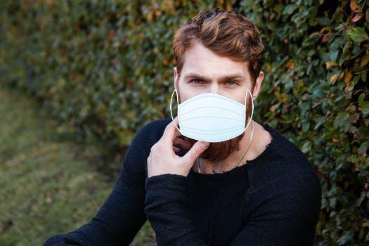

# Real-Time Mask Detection


#Sample Training Dataset (**Mask and without mask**)




# Implementation Details

As **COVID19** is talk of town, it's becaming imperative to use technology to strengthen the hands of our frontline warriors. 
As a deep learning expert, I decided to give a quick hand to develop a model which can check in real-time, if a person is wearing mask or not.
Work includes transfer learning by using pre-trained weights of *MobileNet_V2*. MobileNet is very fast and able to provide realtime-inference.

## This is just proof of concept and implemented quick hand, so don't ask to fork it and use it for your purposes.

# Real-Time Sample Results


# Dataset
Dataset can be either from webcam or any video from realtime showing people in public space. 

# 1. Usage
*Install Library*
`Pytorch`<b>
`OpenCV`<b>
`scipy` <b>
`dlib` <b>
`imutils`<b>
`numpy`<b>
`time`<b>
`argparse`<b>
`sklearn`<b>
`skimage`<b>


# 2. Use Command Line

Command Line execution for the realtime testing can be done by executing-
```
python real_time_test.py --cascade ./haar/haarcascade_frontalface_default.xml \
--model ./model0.pt
```

# 3. Special Thanks/ reference

*The complete dataset has been taken from Prajna Bhandary [GitHub](https://github.com/prajnasb/observations/tree/master/experiements/data) account.* 